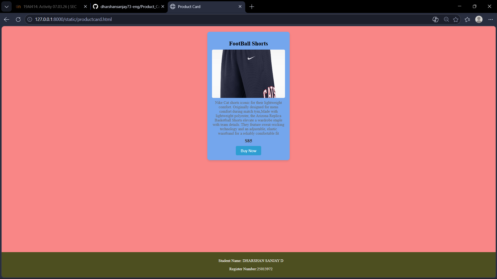

# Product Card Design with Hover Effect using CSS
## Date:9/3/2026

## AIM:
To design a Product Card for an E-commerce website using HTML and CSS and apply hover effects, transitions, and styling techniques to create an interactive user interface.

## DESIGN STEPS:

### Step 1:
Create a basic HTML structure using ```<!DOCTYPE html>, <html>, <head>, and <body>```.

### Step 2:
Add a container div for the product card.

### Step 3:
Insert the product image using the `````` tag.

### Step 4:
Add product name, description, and price using ```<h3>``` and ```<p>``` tags.

### Step 5:
Create an Add to Cart button using the ```<button>``` tag.

### Step 6:
Style the product card using CSS by applying:
<ul>
  <li>width</li>
  <li>padding</li>
  <li>border-radius</li>
  <li>box-shadow</li>
</ul>

### Step 7:
Align the card content using text-align and spacing properties.

### Step 8:
Add hover effects using :hover selector.

### Step 9:
Apply transform: translateY() to move the card slightly upward on hover.

### Step 10:
Increase the box-shadow to create a lifting effect.

### Step 11:
Add transform: scale() to slightly zoom the product image on hover.

### Step 12:
Apply transition property to make the hover animation smooth.

### Step 13:
Create a footer section at the bottom of the page.

### Step 14:
Display Learner Name and Register Number inside the footer.

### Step 15:
Style the footer using background color and center alignment.

### Step 10:
Test your webpage in a browser.

## PROGRAM:
```
<head>
    <meta charset="UTF-8">
    <title>Product Card</title>
    <style>
        body {
            display: flex;
            flex-direction: column;
            justify-content: center;
            align-items: center;
            margin: 5;
            padding: 20px;
            background-color: #f98686;
        }
        .product-card {
            width: 300px;
            background-color: rgb(116, 166, 237);
            border-radius: 10px;
            box-shadow: 0 4px 8px rgba(0, 0, 0, 0.1);
            overflow: hidden;
            text-align: center;
            padding: 20px;
            margin-bottom: 20px;
                }
        .product-image {
            width: 100%;
            height: 200px;
            object-fit: cover;
            border-radius: 5px;
        }
        .product-name {
            font-size: 24px;
            margin: 15px 0 10px 0;
        }
        .product-description {
            font-size: 16px;
            color: #666;
            margin: 10px 0;
        }
        .product-price {
            font-size: 20px;
            font-weight: bold;
            color: #333;
            margin: 10px 0;
        }
        .add-to-cart {
            background-color: #2e9ed2;
            color: white;
            border: none;
            padding: 10px 20px;
            font-size: 16px;
            border-radius: 5px;
           
        }
        .add-to-cart:hover {
            background-color: #457da0;
        }
        footer {
            background-color: #4d4f20;
            color: white;
            text-align: center;
            padding: 10px;
            width: 100%;
            position: fixed;
            bottom: 0;
            left: 0;
        }
    </style>
</head>
<body>
    <div class="product-card">
        <h2 class="product-name">FootBall Shorts</h2>
        
        <p class="product-description">Nike Cat shorts iconic for their lightweight comfort. Originally designed for mens comfort during match tym,Made with lightweight polyester, the Arizona Replica Basketball Shorts elevate a wardrobe staple with team details. They feature sweat-wicking technology and an adjustable, elastic waistband for a reliably comfortable fit</p>
        <p class="product-price">$85</p>
        <button class="add-to-cart">Buy Now</button>
    </div>
    <footer>
        <p>Student Name: DHARSHAN SANJAY D</p>
        <p>Register Number:25013972</p>
    </footer>
</body>
</html>

```
## OUTPUT:

## RESULT:
The Product Card with Hover Effect was successfully designed using HTML and CSS.
